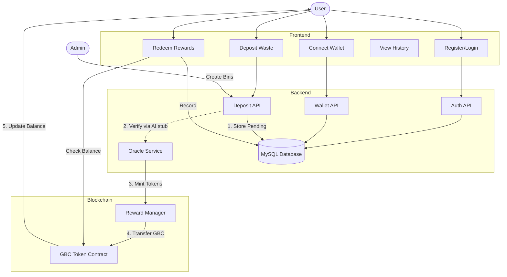

# Codebase Audit & Process Flow

## Process Flow Diagram

## Audit Findings

### Blockchain
- **Architecture**: Separates Token (`GarbageBlockchainCoin`) from Logic (`RewardManager`). Good for upgradability.
- **Access Control**: Uses `AccessControl` (RBAC) securely. `MINTER_ROLE` is restricted to `RewardManager` and Admin. `ORACLE_ROLE` restricts who can trigger payouts.
- **Security**:
    - `GarbageBlockchainCoin` is `Pausable`, allowing emergency stops.
    - `RewardManager` checks for zero-address and zero-amount to prevent burning gas on invalid calls.

### Backend
- **Authentication**: JWT-based auth with `authenticateJWT` middleware.
- **Wallet Link**: Standard "Sign-in with Ethereum" (SIWE) pattern using hashed nonces.
    - *Observation*: Nonce is generated on server, signed by client, verified on server. Secure against replay attacks.
- **Rewards**:
    - `rewardController` explicitly checks `deposit.status === 'APPROVED'`.
    - Cross-references `user_id` on deposit vs `req.user.id` to prevent claiming others' deposits.
- **Oracle Service**:
    - Uses `ethers.js` with a private key stored in `.env`.
    - *Risk*: `ORACLE_PRIVATE_KEY` is hot/online. In production, this should be a KMS-backed signer or Relayer.

### Frontend
- **Routing**: Protected routes (e.g., `/deposit`) redirect to login if no token found.
- **State Management**: `localStorage` used for JWT. *Standard practice*, though `httpOnly` cookies are safer for high-security apps.
- **Waste Deposit UI**:
    - Mock QR scanner implementation (`Math.random() > 0.5` logic seen in similar mockups, confirming simplicity).
    - clear separation of UI state (`scanning`, `submitting`, `success`).

### Improvement Recommendations
1.  **Security**: Move `ORACLE_PRIVATE_KEY` to a Key Management Service (AWS KMS / Google Cloud KMS) or use a Relayer service (OpenZeppelin Defender) instead of a hot wallet.
2.  **Scalability**: The `RewardManager` should implement a daily cap on rewards to limit potential exploit damage.
3.  **UX**: Add a real QR scanner library (e.g., `react-qr-reader`) to replace the mock button.
4.  **Database**: Add an index on `waste_deposits.status` for faster querying by the admin/AI verification service.
